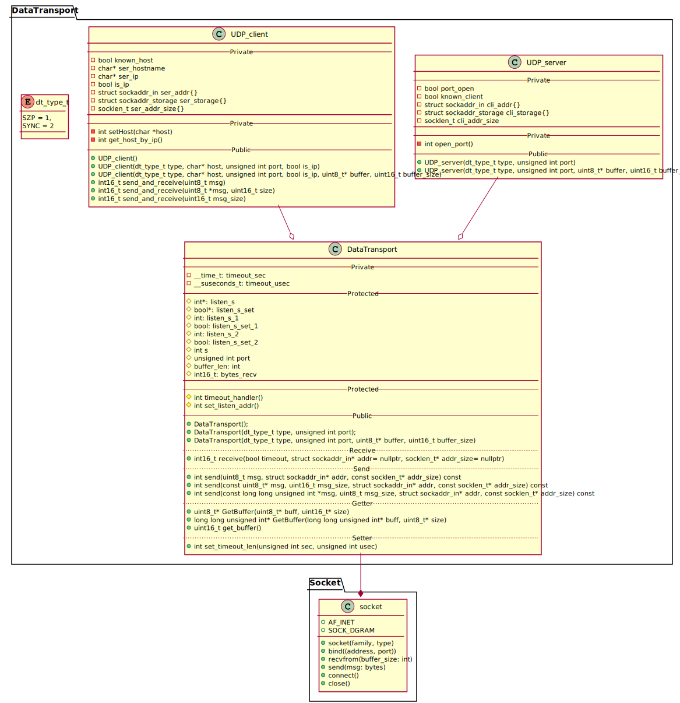

<!-- 
To compile puml use: (Assuming plantuml you are in the directory)
plantuml.jar -tsvg README.md -o diagrams
-->

Version = 0.3.0

A cpp module mainly building on sockets. 
It is used to transport data between a server and clients, for the SoundZone Protocol.
In the layer topology this module is between layer 7 (SZP / sync) and layer 4

The module gives possibilities for either a UDP_server og a UDP_client.

## Class diagram

<!--
```
@startuml class_diagram

package DataTransport{
    UDP_server --o DataTransport
    UDP_client --o DataTransport
    
    enum dt_type_t{
        SZP = 1,
        SYNC = 2
    }
}

package Socket{
    DataTransport --* socket
}


class UDP_server {
    --Private--
    - bool port_open
    - bool known_client
    - struct sockaddr_in cli_addr{}
    - struct sockaddr_storage cli_storage{}
    - socklen_t cli_addr_size
    ___
    --Private--
    - int open_port()
    --Public--
    + UDP_server(dt_type_t type, unsigned int port)
    + UDP_server(dt_type_t type, unsigned int port, uint8_t* buffer, uint16_t buffer_size)
}

class UDP_client {
    --Private--
    - bool known_host
    - char* ser_hostname
    - char* ser_ip
    - bool is_ip
    - struct sockaddr_in ser_addr{}
    - struct sockaddr_storage ser_storage{}
    - socklen_t ser_addr_size{}
    ___
    --Private--
    - int setHost(char *host)
    - int get_host_by_ip()
    --Public--
    + UDP_client()
    + UDP_client(dt_type_t type, char* host, unsigned int port, bool is_ip)
    + UDP_client(dt_type_t type, char* host, unsigned int port, bool is_ip, uint8_t* buffer, uint16_t buffer_size)
    + int16_t send_and_receive(uint8_t msg)
    + int16_t send_and_receive(uint8_t *msg, uint16_t size)
    + int16_t send_and_receive(uint16_t msg_size)
}

class DataTransport {
    --Private--
    - __time_t: timeout_sec
    - __suseconds_t: timeout_usec
    --Protected--
    # int*: listen_s
    # bool*: listen_s_set
    # {static} int: listen_s_1
    # {static} bool: listen_s_set_1
    # {static} int: listen_s_2
    # {static} bool: listen_s_set_2
    # int s
    # unsigned int port
    # buffer_len: int
    # int16_t: bytes_recv
    ___
    --Protected--
    # int timeout_handler()
    # int set_listen_addr()
    --Public--
    + DataTransport();
    + DataTransport(dt_type_t type, unsigned int port);
    + DataTransport(dt_type_t type, unsigned int port, uint8_t* buffer, uint16_t buffer_size)
    ..Receive..
    + int16_t receive(bool timeout, struct sockaddr_in* addr= nullptr, socklen_t* addr_size= nullptr)
    ..Send..
    + int send(uint8_t msg, struct sockaddr_in* addr, const socklen_t* addr_size) const
    + int send(const uint8_t* msg, uint16_t msg_size, struct sockaddr_in* addr, const socklen_t* addr_size) const
    + int send(const long long unsigned int *msg, uint8_t msg_size, struct sockaddr_in* addr, const socklen_t* addr_size) const
    ..Getter..
    + uint8_t* GetBuffer(uint8_t* buff, uint16_t* size)
    + long long unsigned int* GetBuffer(long long unsigned int* buff, uint8_t* size)
    + uint16_t get_buffer()
    ..Setter..
    + int set_timeout_len(unsigned int sec, unsigned int usec)
}

class socket {
    + AF_INET
    + SOCK_DGRAM

    + socket(family, type)
    + bind((address, port))
    + recvfrom(buffer_size: int)
    + send(msg: bytes)
    + connect()
    + close()
}

note right of socket::SOCK_DGRAM
    UDP
end note


@enduml
```
-->


